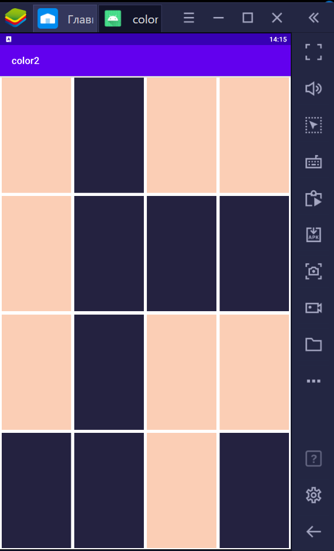
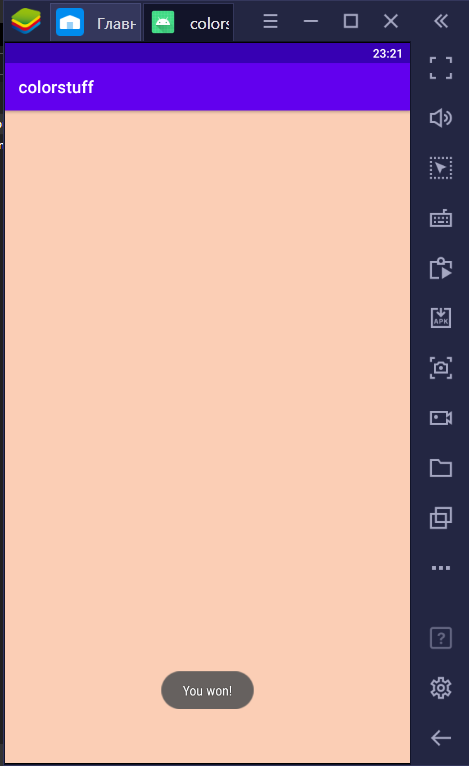
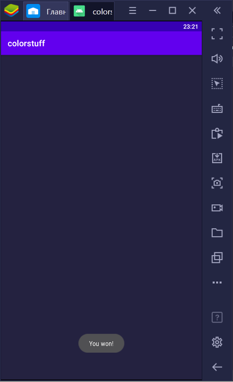

# Головоломка ColorTiles с интерфейсом на основе Canvas

Существующее приложение, описанное в задании (головоломка Color Tiles) необходимо переделать с использованием двумерной графики. Фактически нужно реализовать класс, основанный на View, где реализовать конструкторы, методы onDraw(), onTouchEvent().

За основу можно взять проект-заготовку: https://github.com/ipetrushin/ColorTilesCnv Там же в комментариях даны советы по выполнению.

В качестве решения приложите код классов и снимки экрана с демонстрацией приложения.

